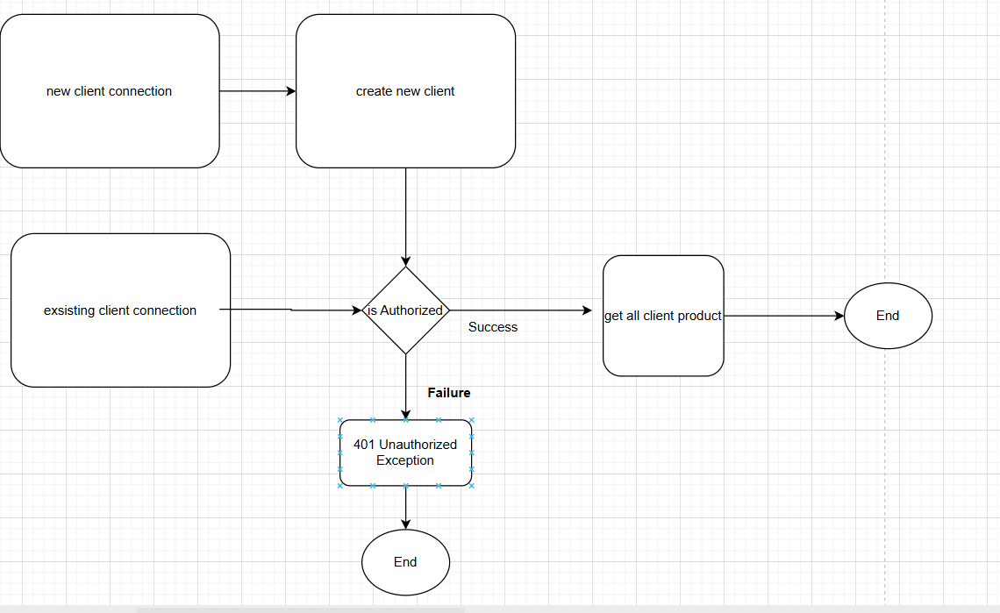

# InsuredProcess API

A Spring Boot REST API for managing insurance clients and products using in-memory storage.

## Architecture
- Spring Boot 3, Java 17
- In-memory repositories backed by ConcurrentHashMap
- Controllers + Services + DTOs + Domain
- OpenAPI via springdoc
- Global exception handling via @ControllerAdvice
Diagram:

```
## Domain & Enums
- Client, Product, ClientProduct, ContactMethod
- ContactMethodType: EMAIL, PHONE, SMS
- ProductStatus: ACTIVE, INACTIVE, SUSPENDED, CANCELLED

## Validation & Errors
- DTOs use Bean Validation (@NotBlank/@NotNull)
- Consistent error responses: `{ status, message, timestamp }` from GlobalExceptionHandler

## API Endpoints
- POST /api/clients/create — create client
- POST /api/clients/existing — authenticate and get client products
- POST /api/products/buy — buy product (requires clientId + contactMethod)
- PUT /api/products/update — update product status

## Sample Payloads
Create client
```http
POST /api/clients/create
Content-Type: application/json
{
  "id": "C001",
  "contactMethod": { "methodType": "EMAIL", "methodValue": "john@example.org" }
}
```

Authenticate & get products
```http
POST /api/clients/existing
Content-Type: application/json
{
  "id": "C001",
  "contactMethod": { "methodType": "EMAIL", "methodValue": "john@example.org" }
}
```

List catalog
```http
GET /api/products
```

Buy product
```http
POST /api/products/buy
Content-Type: application/json
{
  "clientId": "C001",
  "productId": "P001",
  "contactMethod": { "methodType": "EMAIL", "methodValue": "john@example.org" }
}
```

Update product status
```http
PUT /api/products/update
Content-Type: application/json
{
  "clientId": "C001",
  "productId": "P001",
  "status": "ACTIVE"
}
```

## Run locally
Prereqs: JDK 17, Gradle wrapper included

Build & run
```bash
./gradlew clean build
./gradlew bootRun
```
Server: http://localhost:8080

Swagger UI (springdoc):
- http://localhost:8080/swagger-ui/index.html

## Notes
- No database; runtime-only objects
- Each client can have each product only once (enforced)
- Product catalog is pre-seeded in memory
- OpenAPI JSON exists under `src/main/resources/swagger/InsuredProcess.json`; prefer generating from code to avoid drift

## Known improvements
- Align OpenAPI spec paths with controllers
- Add more validation (email/phone formats)
- Add auth to update endpoint if required
- Add tests for services/controllers
